# simgym

A browser tool for sketching time-series data. Draw a trend on an axed canvas
with adjustable time (X) and value (Y) scales, and it's sampled into
`(timestamp, value)` pairs you can read in a table or download as CSV / JSON.

## Features

- **Adjustable axes** — real wall-clock start time, duration, and Y min/max, all live.
- **Configurable sampling** — set the interval (seconds) between emitted points.
- **Draw-once canvas** — drag to sketch a trend; **Clear** wipes it.
- **Live sample table** — index / ISO timestamp / value, updating as you draw.
- **Export** — download the series as CSV or JSON.

The stroke is stored as one Y-value per pixel column, so a drawing is always a
proper function of time: backtracking overwrites columns rather than producing
duplicate or out-of-order timestamps.

## Requirements

- [Node.js](https://nodejs.org/) 18+ and npm.

## Install

```bash
npm install
```

## Run (development)

```bash
npm run dev
```

Then open the printed URL (default http://localhost:5173/).

## Build (production)

```bash
npm run build      # type-checks, then bundles to dist/
npm run preview    # serve the built dist/ locally to check it
```

The static output lands in `dist/` and can be hosted anywhere.

## Usage

1. Set the **start time**, **duration**, **interval**, and **Y min/max**.
2. Drag left-to-right across the canvas to draw a trend.
3. Read the sampled `(timestamp, value)` pairs in the table below.
4. **Download CSV / JSON**, or **Clear** to start over.

Columns you don't draw over are exported with an empty value.

## Architecture

`main.ts` is the imperative shell: it owns the DOM and drives a single
`recompute()` on every change. The stroke lives in `plot.ts` as one Y-fraction per
pixel column (so a drawing is always a function of X); `sampling.ts` and `export.ts`
are pure transforms over it.

```mermaid
flowchart TD
    subgraph controls["Controls (main.ts)"]
        C["start · duration · interval · Y min/max"]
    end
    subgraph plot["PlotCanvas (plot.ts)"]
        B["column buffer<br/>Float32Array: one yFrac per pixel column"]
    end

    C -->|readConfig| CFG["AxisConfig"]
    Pointer["pointer drag"] -->|"fillColumns (interpolated)"| B

    CFG --> R{{"recompute() — main.ts"}}
    B  -->|yFracAtXFrac| R

    R -->|"sample()"| S["Sample[]<br/>t · iso · value|null"]
    R -->|buildTicks| T["x/y Tick[]"]

    S --> TABLE["sample table"]
    S --> MARK["canvas markers"]
    T --> plot
    MARK --> plot

    S -->|"toCSV / toJSON → download"| FILE["CSV / JSON file"]

    classDef pure fill:#132,stroke:#5c8;
    class S,T pure;
```



A resize reallocates the column buffer (its length is the plot's pixel width) and
therefore **clears the current sketch**.

## Project layout

| File | Role |
|------|------|
| `src/plot.ts` | Canvas, axes, drawing, per-column stroke buffer (pixel-space) |
| `src/sampling.ts` | Stroke buffer + axis config → `(timestamp, value)[]` |
| `src/export.ts` | CSV / JSON serialization and file download |
| `src/types.ts` | `AxisConfig`, `Sample`, `Tick` |
| `src/main.ts` | UI, controls, ticks, sample table |

## Tech

Framework-free [Vite](https://vitejs.dev/) + TypeScript + HTML canvas. No backend;
export is a client-side file download.
